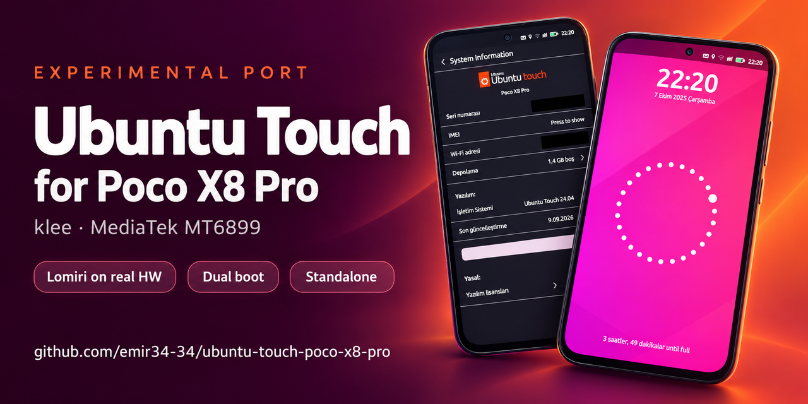
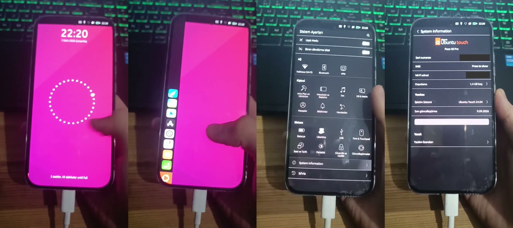
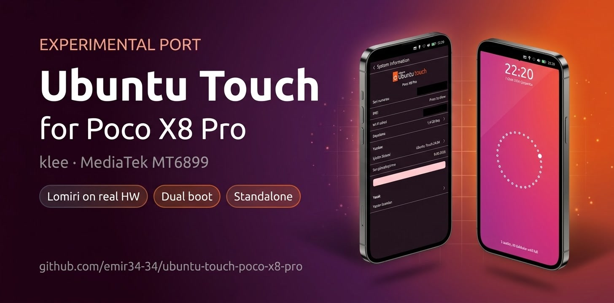
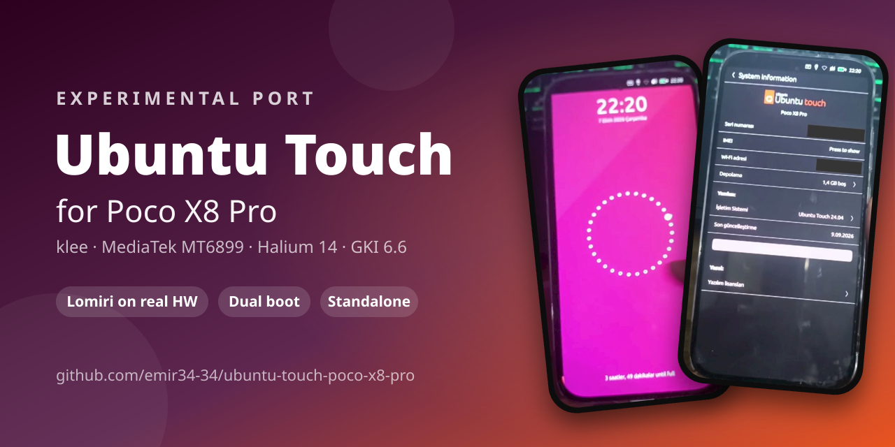

# Ubuntu Touch for the Poco X8 Pro (klee, MT6899)

This is an experimental Ubuntu Touch port for the Xiaomi Poco X8 Pro (codename `klee`, model
2511FPC34G, MediaTek mt6899). There are two ways to install it:

- **Dual boot** (`release/install.sh`, tested on the device): Ubuntu Touch sits next to an
  Android ROM (AxionAOSP, Android 16). `/data` is never wiped. Ubuntu Touch lives in a new
  logical partition (`ut_data`) created in the free space of the `super` partition.
- **Standalone** (`release/install-standalone.sh`, **not tested on the device**): Ubuntu Touch
  replaces Android. It gets the whole `userdata` partition as ext4, so **all Android data is
  erased**. It uses the same kernel, ramdisk and rootfs as the dual boot install; only the
  data partition differs. `release/restore-android.sh` goes back to Android.

> **Status: abandoned by the original author (2026-10-08).** The code, scripts and all notes
> are published here so that others can continue. Forks and pull requests are welcome.



*Lock screen, launcher, system settings and system information, from a video of the real
device. Serial number and Wi-Fi MAC are hidden.*

## Disclaimer

**Use this at your own risk.** This is an experimental, unfinished port. Flashing it can
brick your phone, put it into a boot loop, wipe your data or make the IMEI disappear. The
standalone install erases all Android data by design. The author takes **no responsibility**
for any damage to your device or data, and gives **no support** for individual installs. If
you are not comfortable recovering a phone from fastboot yourself, do not install this.
Before you start, back up everything, especially the IMEI/NVRAM partitions.

This software is provided "as is", without warranty of any kind (see the GPL-2.0, sections 11
and 12).

## What worked on real hardware

| Component | Status |
|---|---|
| Kernel (UBports `android15-6.6-halium`, 6.6.x GKI) + vendor modules | ✅ 0 KMI CRC mismatches across 592 modules |
| Halium 14 GSI container on an Android 16 vendor | ✅ with compatibility patches |
| Display (composer3), Lomiri UI, brightness | ✅ see notes: `free()` shim, `mi_display` backlight |
| Touch | ✅ |
| Wi-Fi | ❌ does not work: `wlan0` appears (`/dev/wmtWifi`) but no connection was achieved |
| Modem / SIM detection | ✅ ICCID read; calls and data not tested |
| Battery (`mtk_battery_manager` CRC fix) | ✅ |
| Reset after ~140 s (MediaTek MKP, `pid_max`) | ✅ fixed |
| Audio, camera, fingerprint, VoLTE | ❌ not attempted |
| Switching OS without a computer (via OrangeFox) | ❌ unfinished; the phone fell into a BROM loop |

## ⚠️ Read this before you start

1. **IMEI risk.** SELinux is off in Ubuntu Touch. The modem services in the Android container
   rewrite files in `protect_s`/`persist` **without SELinux labels**. Back in Android the modem
   then crashes and the IMEI disappears. There are two layers of protection:
   - `port/overlay/.../klee-selinux-guard` on the Ubuntu Touch side
   - `port/android-side/ksu-module` on the Android side (KernelSU post-fs-data)

   Do not boot Ubuntu Touch without both. The details are in the development notes.
2. **Back up the IMEI/NVRAM partitions.** `release/install.sh` does this: nvram, nvdata, nvcfg,
   protect1/2, md_sec, persist and proinfo.
3. While Android is running, the **active slot's `boot`/`init_boot` partitions are hardware
   write-protected** (UFS DATA PROTECT). Boot images can only be written from fastboot or recovery.
4. The bootloader (LK) is never modified, so **Volume Down + Power** always reaches fastboot.
   If everything breaks, flash Android's `boot`/`init_boot`/`vendor_boot` images back from there.
   Step-by-step recovery for every problem met during development:
   [docs/TROUBLESHOOTING.md](docs/TROUBLESHOOTING.md).

## Repository layout

| Directory | Contents |
|---|---|
| `port/` | The port itself, based on the UBports `halium-gki` template: `build-klee.sh`, `deviceinfo`, `klee.config`, `ramdisk-overlay/` (initramfs patches, slot-aware `sbin/lp-map`), `overlay/` (files and services added to the rootfs), `rootfs-patches/`, `android-side/` (Android/OrangeFox scripts and the KernelSU module), `tools/make-hybrid-vendor-boot-ramdisk.py` |
| `kernel/` | Patch against UBports `kernel-android-common` (`android15-6.6-halium`) (`klee-kernel.patch`), `klee.config`, base commit (`BASE_COMMIT`) |
| `shims/` | glibc↔bionic shims: `klee_free.c` routes bionic memory away from glibc `free()`; GL and window debugging shims |
| `host-tools/` | Host-side checkers: `kmi_check.py`, `abi_check.py`, `add_noop_syms.py`, `crc_check_module.py`, `payload_extract.py` and others |
| `qemu-test/` | QEMU integration test with the real kernel, initramfs and rootfs plus Axion's vendor partitions |
| `apps/android-reboot-ubuntu/` | "Switch to Ubuntu" Android app (`build.sh`, no Gradle) |
| `release/` | User scripts: `install.sh`, `boot-ubuntu.sh`, `boot-axion.sh`, `uninstall.sh`, `collect-logs.sh`, plus `README.md` and `TECHNICAL-NOTES.md` |
| `docs/` | **`DEVELOPMENT-NOTES.md`**: everything learned on the device, in rough chronological order. **`TROUBLESHOOTING.md`**: how to get out of a boot loop, lost IMEI and other problems. `screenshots/` |

The built images (`ut_boot.img`, `ut_init_boot.img`, `ubuntu.img`) are **not** included. They
are large and contained the developer's SSH key. Build them from source.

## Building (summary)

You need:
- Linux
- AOSP clang `r510928`, the same compiler as the stock kernel
- `sudo`, for loop mounts
- `lz4`
- `mkbootimg`/`avbtool` (the build script downloads these)
- the Halium 14 rootfs from UBports CI (`halium-gki` → `devel-flashable-android14-6.1`)

```sh
# kernel
git clone -b android15-6.6-halium https://gitlab.com/ubports/porting/community-ports/android12/generic/kernel-android-common.git ~/klee-ut/kernel
cd ~/klee-ut/kernel && git checkout $(cut -d' ' -f1 /path/to/kernel/BASE_COMMIT) && git apply /path/to/kernel/klee-kernel.patch

# port: adjust the path variables at the top of build-klee.sh; the paths must not contain spaces
cp -r port ~/klee-ut/ubports-klee
~/klee-ut/ubports-klee/build-klee.sh          # supports SKIP_KERNEL=1 / SKIP_ROOTFS=1
```

For SSH over USB, put your own public key in `port/overlay/system/etc/klee/authorized_keys`.
Once Ubuntu Touch is up, connect with `ssh -p 8022 root@10.15.19.82` (USB NCM).

Installation (dual boot or standalone) and switching steps: [release/README.md](release/README.md).

## Next steps (for whoever picks this up)

- **Switching OS without a computer.** The active slot's `boot` partition cannot be written
  while Android is running. Two options:
  - (a) Write it from OrangeFox recovery, using `android-side/klee-switch.sh` and the hybrid
    `vendor_boot` (`tools/make-hybrid-vendor-boot-ramdisk.py`). In the last attempt the phone
    rebooted during the write and fell into a BROM loop. The cause was not found.
  - (b) The slot method: an Axion copy plus the Ubuntu Touch boot images on the inactive slot `_a`.
- **Audio:** vendor AIDL audio core v2/v3 ↔ pulseaudio-droid / audiosystem-passthrough.
- **Wi-Fi:** `wlan0` comes up after writing `1` to `/dev/wmtWifi`, but Wi-Fi did not work in practice.
  Not debugged yet (wpa_supplicant/NetworkManager vs. the MTK WLAN driver and firmware).
- **Remaining hardware:** camera, fingerprint, calls and data, power management.

## Banners

The banner at the top was made with ChatGPT from the real screenshots. Two alternatives, free to
use for posts about the project:

| `docs/banner2.jpg` (Gemini) | `docs/banner3.png` (hand-made from video frames) |
|---|---|
|  |  |

## Credits

UBports (halium-gki, kernel-android-common), Halium, the OrangeFox klee maintainers and the
AxionAOSP klee maintainer.

## License

The klee-specific code, scripts and tools in this repository are shared under GPL-2.0.
- Files taken from UBports `halium-gki` (`port/build/` and the basis of the ramdisk scripts)
  remain under UBports' own terms: halium-gki `e05c1ebd0aab`, build subrepository `78d5df8abeaa`.
- The kernel patch is GPL-2.0.
- The binaries under `port/overlay/.../halium-overlay/system/lib64/` come from AOSP/LLVM
  (Apache-2.0). `libbinder_ndk.so` was patched with `host-tools/add_noop_syms.py`.
